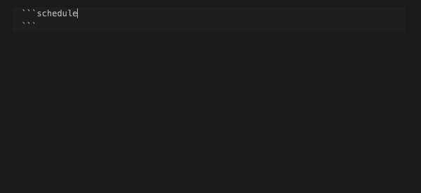
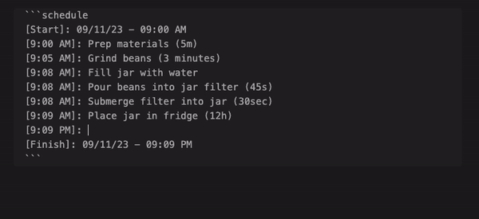

# Obsidian Timeline Schedule

Inline timelines generated from human-readable time strings, e.g. 'Walk dog (30min)' in a ```schedule codeblock in [Obsidian](https://obsidian.md).

You can set if you want to enable pretty preview and/or autofill from the plugin's settings.

## Only pretty preview, no autofill


Each human-readable time string you add to the end of a line will be added to the total time and displayed before the next event.

For instance, `Grind beans (3m)` sets the time from `7:05` to `7:08`.

In this mode, you don't need date blocks, e.g. (`[Start]`, `[Finish]`), the `start` date is set from whatever you put at the beginning e.g. "Start: 08/10/2023 08:00 AM"

If you omit a start line, the current date & time will be used.

## Only autofill, no pretty preview



A `[Start]` and `[Finish]` block will always be present during autofill, and each line between them will be prepended with a time block e.g. `[9:30 AM]:`.

In this mode, when your cursor exits the codeblock it will preview as a standard Obsidian code block.

# Both autofill and pretty preview (default)



You can change the name for `Start` and `Finish` as well as the formats of the start, end, and event dates in the plugin's settings.

## Styling

See [styles.css](./styles.css) for a list of classes you can override.

## Installing

Search "Timeline Schedule" via the [built-in community plugin browser](https://help.obsidian.md/Extending+Obsidian/Community+plugins) in Obsidian.

## Contributing

Please [open an issue](https://github.com/Ebonsignori/obsidian-timeline-schedule/issues/new) with any suggestions or bug reports.

See [developer docs](docs/development.md) if you'd like to open a PR.

## Acknowledgements

[The Obsidian team](https://obsidian.md/about) for creating a wonderful product :purple_heart:
