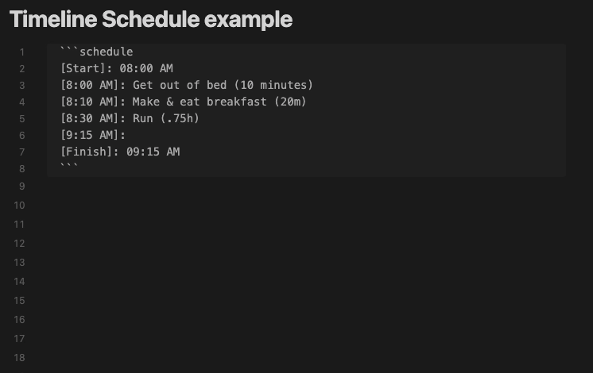

# Obsidian Timeline Schedule



Inline timelines generated from human-readable time strings, e.g. 'Walk dog (30min)' in a ```schedule codeblock. For [Obsidian](https://obsidian.md).

## Styling

See [styles.css](./styles.css) for a list of classes you can override.

## Installing

Search "Timeline Schedule" via the [built-in community plugin browser](https://help.obsidian.md/Extending+Obsidian/Community+plugins) in Obsidian.

## Contributing

Please [open an issue](https://github.com/Ebonsignori/obsidian-timeline-schedule/issues/new) with any suggestions or bug reports.

See [developer docs](docs/development.md) if you'd like to open a PR.

## Acknowledgements

[The Obsidian team](https://obsidian.md/about) for creating a wonderful product :purple_heart:
